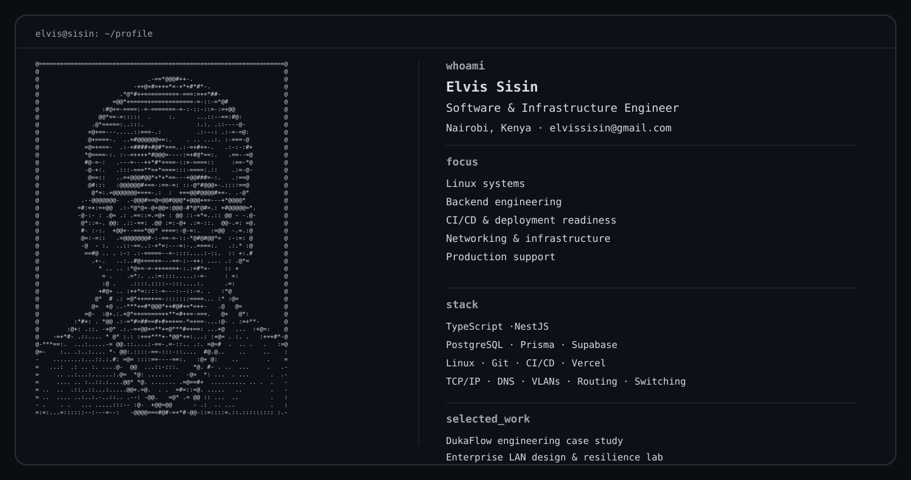

# Elvis Sisin



I work on software and infrastructure problems that often sit between application code and the systems running it. My professional background is in IT operations and network support; my engineering projects extend that into backend development, databases, authorization, automated testing, CI/CD, and deployment verification.

## Selected public work

### DukaFlow — Engineering Case Study

Sanitized engineering case study of a multi-tenant business-management platform, covering tenant-scoped authorization, database RLS, offline POS state and synchronization, M-Pesa payment reliability, automated testing, and release qualification.

[View the DukaFlow engineering case study](https://github.com/SisinElvis/dukaflow-engineering-case-study)

### Enterprise LAN Design & Resilience Lab

Cisco Packet Tracer campus LAN covering VLAN segmentation, HSRP gateway redundancy, OSPF path preference, split-scope DHCP, inter-VLAN ACLs, LACP, Rapid-PVST, and dual NAT/PAT edge routing.

[View the network engineering project](https://github.com/SisinElvis/LAN_Project)

## Engineering approach

```text
inspect → establish authority → change minimally → test → verify
```

I prefer to start from the system's actual state, make the smallest change I can justify, and verify the result before moving on.
